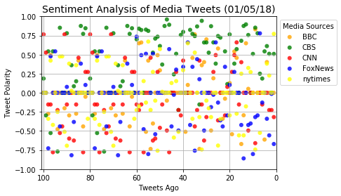
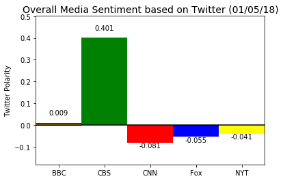

# Media Sentiment Analysis

### Analyses the Sentiment on the last 100 tweets of the Media Channels: 
### *BBC,CNN,CBS,FoxNew and New York Times*

#### Also plots the overall Sentiment analysis on each of the channels


```python
# Dependencies
import tweepy
import json
import numpy as np
import pandas as pd
import matplotlib.pyplot as plt
import time

# Import and Initialize Sentiment Analyzer
from vaderSentiment.vaderSentiment import SentimentIntensityAnalyzer
analyzer = SentimentIntensityAnalyzer()

# Twitter API Keys
consumer_key = "Provide your key"
consumer_secret = "Provide your key"
access_token = "Provide your key"
access_token_secret = "Provide your key"

# Setup Tweepy API Authentication
auth = tweepy.OAuthHandler(consumer_key, consumer_secret)
auth.set_access_token(access_token, access_token_secret)
api = tweepy.API(auth, parser=tweepy.parsers.JSONParser())
```


```python
# Target Search Term of the various Media channels
Media_users = ("@BBC", "@CBS", "@CNN","@FoxNews", "@nytimes")

# Array to hold sentiment
Sentiment_array = []

```


```python
# Extracting the first 100 tweets in each Media Channel
print("Beginning of extraction of the posted tweets from the media channels")

for user in Media_users:
    # Setting the tweet count as 100
    tweetcount=100
    print("Extracting tweets from %s"%user)
    
    # Extracting 5 pages of tweets
    for x in range(5):
        public_tweets=api.user_timeline(user,page=x)
        # For each tweet 
        for tweet in public_tweets:
            #Calculating the compound,positive,negative and neutral value for each tweet
            compound = analyzer.polarity_scores(tweet["text"])["compound"]
            pos = analyzer.polarity_scores(tweet["text"])["pos"]
            neu = analyzer.polarity_scores(tweet["text"])["neu"]
            neg = analyzer.polarity_scores(tweet["text"])["neg"]
            # Store Tweet in Array
            Sentiment_array.append({"Media":user,
                                    "Tweet Text":tweet["text"],
                                    "Compound":compound,
                                    "Positive":pos,
                                    "Negative":neg,
                                    "Neutral":neu,
                                    "Date":tweet["created_at"],
                                    "Tweets Ago":tweetcount})
            #Decreasing tweet count by 1
            tweetcount-=1

print("End of Extraction of Tweets")
```

    Beginning of extraction of the posted tweets from the media channels
    Extracting tweets from @BBC
    Extracting tweets from @CBS
    Extracting tweets from @CNN
    Extracting tweets from @FoxNews
    Extracting tweets from @nytimes
    End of Extraction of Tweets
    


```python
# Creating a dataframe from the Sentiment Array
Sentiment_DF=pd.DataFrame.from_dict(Sentiment_array)
# Removing the '@' from Media column in the data frame
Sentiment_DF['Media'] = Sentiment_DF['Media'].map(lambda x: x.lstrip('@'))

# Re_arranging the order of columns before saving into CSV file
Sentiment_DF=Sentiment_DF[["Media","Date","Tweet Text","Compound","Positive","Negative","Neutral","Tweets Ago"]]
# Storing into a CSV File\
Sentiment_DF.to_csv("Output/Media_SentimentAnalysis.csv")

Sentiment_DF.head()
```


<div>
<style>
    .dataframe thead tr:only-child th {
        text-align: right;
    }

    .dataframe thead th {
        text-align: left;
    }

    .dataframe tbody tr th {
        vertical-align: top;
    }
</style>
<table border="1" class="dataframe">
  <thead>
    <tr style="text-align: right;">
      <th></th>
      <th>Media</th>
      <th>Date</th>
      <th>Tweet Text</th>
      <th>Compound</th>
      <th>Positive</th>
      <th>Negative</th>
      <th>Neutral</th>
      <th>Tweets Ago</th>
    </tr>
  </thead>
  <tbody>
    <tr>
      <th>0</th>
      <td>BBC</td>
      <td>Fri Jan 05 15:27:42 +0000 2018</td>
      <td>RT @BBCOne: So, what exactly is #HardSun? 🤔 We...</td>
      <td>0.0000</td>
      <td>0.000</td>
      <td>0.000</td>
      <td>1.000</td>
      <td>100</td>
    </tr>
    <tr>
      <th>1</th>
      <td>BBC</td>
      <td>Fri Jan 05 14:33:07 +0000 2018</td>
      <td>☕️ An estimated 2.5 billion disposable coffee ...</td>
      <td>0.0000</td>
      <td>0.000</td>
      <td>0.000</td>
      <td>1.000</td>
      <td>99</td>
    </tr>
    <tr>
      <th>2</th>
      <td>BBC</td>
      <td>Fri Jan 05 14:23:24 +0000 2018</td>
      <td>RT @bbcthree: In 2012, Naomi was the victim of...</td>
      <td>-0.2732</td>
      <td>0.118</td>
      <td>0.198</td>
      <td>0.684</td>
      <td>98</td>
    </tr>
    <tr>
      <th>3</th>
      <td>BBC</td>
      <td>Fri Jan 05 14:00:06 +0000 2018</td>
      <td>How do you keep your New Year's resolution to ...</td>
      <td>0.4939</td>
      <td>0.176</td>
      <td>0.000</td>
      <td>0.824</td>
      <td>97</td>
    </tr>
    <tr>
      <th>4</th>
      <td>BBC</td>
      <td>Fri Jan 05 13:33:12 +0000 2018</td>
      <td>Here's how the weather has looked around the w...</td>
      <td>0.0000</td>
      <td>0.000</td>
      <td>0.000</td>
      <td>1.000</td>
      <td>96</td>
    </tr>
  </tbody>
</table>
</div>


```python
# Creating an array with the unique Media sources in the data frame
Media_Source=Sentiment_DF["Media"].unique()

#Plotting the graph for each media source
for media in Media_Source:
    # Creating a temporary data frame to store for only one media channel at a time
    Temp_DF=Sentiment_DF[Sentiment_DF["Media"]==media]
    plt.scatter(Temp_DF["Tweets Ago"],Temp_DF["Compound"], marker="o", linewidth=0, alpha=0.8, label=media,
                facecolors=Temp_DF.Media.map({"BBC": "orange", "CBS" : "green",  "CNN": 'red',
                                              "FoxNews":"blue","nytimes":"yellow"}))


#plt.hlines(0,0,np.arange(len(Sentiment_DF["Compound"])),alpha=1)
# Setting the legend 
plt.legend(bbox_to_anchor = (1,1),title="Media Sources")
# Setting the title,x_axis and y_axis labels
plt.title("Sentiment Analysis of Media Tweets (%s)" % (time.strftime("%x")), fontsize=14)
plt.xlabel("Tweets Ago")
plt.ylabel("Tweet Polarity")
#Setting the x_axis and y_axis limits
plt.xlim(101,0)
plt.ylim(-1,1)
# Setting the grid
plt.grid(True)

# Saving the figue
plt.savefig("Output/Sentiment Analysis of Media Tweets.png",bbox_inches='tight')

plt.show()
```





```python
# Calculating the mean for each Media channel and storing to a dataframe
Media_Compound_Means=Sentiment_DF.groupby("Media").mean()["Compound"].to_frame()
#Resetting the index 
Media_Compound_Means.reset_index(inplace=True)

Media_Compound_Means
```


<div>
<style>
    .dataframe thead tr:only-child th {
        text-align: right;
    }

    .dataframe thead th {
        text-align: left;
    }

    .dataframe tbody tr th {
        vertical-align: top;
    }
</style>
<table border="1" class="dataframe">
  <thead>
    <tr style="text-align: right;">
      <th></th>
      <th>Media</th>
      <th>Compound</th>
    </tr>
  </thead>
  <tbody>
    <tr>
      <th>0</th>
      <td>BBC</td>
      <td>0.009111</td>
    </tr>
    <tr>
      <th>1</th>
      <td>CBS</td>
      <td>0.401121</td>
    </tr>
    <tr>
      <th>2</th>
      <td>CNN</td>
      <td>-0.081220</td>
    </tr>
    <tr>
      <th>3</th>
      <td>FoxNews</td>
      <td>-0.054593</td>
    </tr>
    <tr>
      <th>4</th>
      <td>nytimes</td>
      <td>-0.040645</td>
    </tr>
  </tbody>
</table>
</div>


```python
# Setting the x_axis and y-axis value
x_axis=Media_Compound_Means.index.values
y_axis=Media_Compound_Means["Compound"]

# Intializing the plots
fig,ax=plt.subplots()

#Setting the plot and assigning the color based on the Positive or not value
bars=ax.bar(x_axis,y_axis,align="edge",width=1,linewidth=1,
            edgecolor='black',color=["orange","green","red","blue","yellow"])

# Setting the ticks for the bar graph
tick_locations = [value+0.5 for value in range(len(x_axis))]
plt.xticks(tick_locations,["BBC","CBS","CNN","Fox","NYT"])

# Setting the text label in the bar graph
# If value is positive then put True in the Summary else place False, for changing the color based on the value
Media_Compound_Means["Positive"]=Media_Compound_Means["Compound"]>0
# Assign the height based on whether it is a  positive value
height = Media_Compound_Means.Positive.map({True: 0.03 , False: -0.03})
# Setting the value label on the each bar
for bar in bars:
    ax.text(bar.get_x() + bar.get_width()/2, bar.get_height()+height[bars.index(bar)],
            round(Media_Compound_Means["Compound"][bars.index(bar)],3),ha='center', va='bottom')


# Setting the x_axis limits
ax.set_xlim(0, len(x_axis))
#Setting the y_axis limits dynamically by finding the maximum and minimum value in y-axis
ax.set_ylim(min(y_axis)-0.1, max(y_axis)+0.1)

# Setting a horizontal line at y=0
plt.hlines(0,0,len(x_axis))

# Setting the title of the graph
ax.set_title("Overall Media Sentiment based on Twitter (%s)" % (time.strftime("%x")), fontsize=14)
# Setting the y_axis label
ax.set_ylabel("Twitter Polarity")

# Saving the graph
plt.savefig("Output/Overall_Media_Sentiment_based_on_Twitter.png",bbox_inches='tight')
plt.show()
```





### Summary
### Based on the analysis performed on 5 December 2018
* CBS has the most positive sentiment analysis compared to the rest followed by BBC. 
* BBC has the most neutralsentiment analysis compared to the rest.
* CNN has the most negative sentiment analysis compared to remaining followed by Fox and New York Times respectively.
